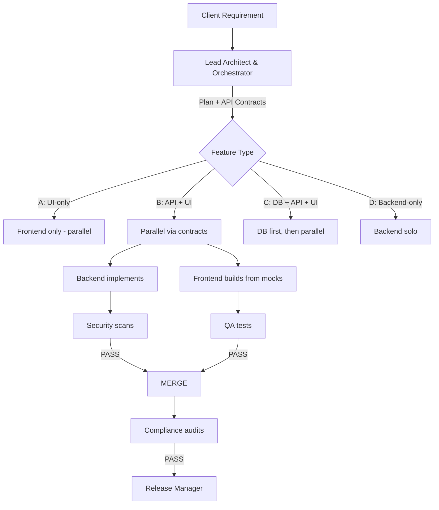
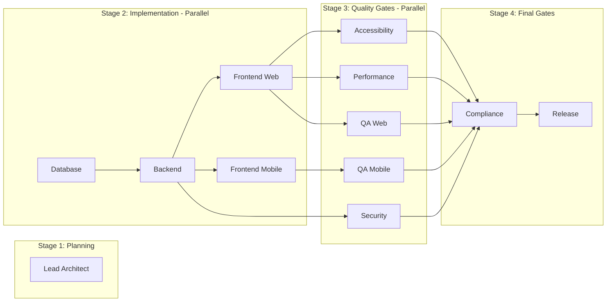

# Agent Flow — Agency Pipeline Reference

> **Active orchestration document** for the AI Software Agency.
> For live status tracking, see [ORCHESTRATION.md](ORCHESTRATION.md).
> For standard operating procedures, see [AGENCY-PLAYBOOK.md](AGENCY-PLAYBOOK.md).
> For project configuration, see `.agency/config.json`.

---

## Pipeline Overview



---

## Agent Sub-Role Hierarchy

| Team | Lead | Specialists |
|------|------|-------------|
| 🧠 Architecture | Lead Architect & Orchestrator | — |
| ⚙️ Backend | Backend Lead | API, Service, Integration |
| 🌐 Frontend Web | Frontend Web Lead | UI, Page, State |
| 📱 Frontend Mobile | Mobile Lead | UI, Screen, State |
| 🚀 DevOps | DevOps Lead | Infra, CI/CD, DB Admin |
| 🔒 Security | Security Auditor | — |
| ⚡ Performance | Performance Auditor | — |
| ♿ Accessibility | Accessibility Auditor | — |
| 🧪 QA | QA Automator | — |
| 🛡️ Compliance | Compliance Guardian | — |
| 📦 Release | Release Manager | — |
| 📝 Documentation | Documentarian | — |
| 🎨 Design | Design Keeper | — |

---

## Dependency Graph



---

## Parallel Execution Rules

| Feature Type | DB | Backend | Frontend Web | Frontend Mobile | Strategy |
|---|---|---|---|---|---|
| **A: UI-only** | — | — | ✅ Immediate | ✅ Immediate | Full parallel |
| **B: New API + UI** | — | 🔄 From contracts | ✅ From mocks via contracts | ✅ From mocks via contracts | Backend + Frontend in parallel |
| **C: Schema + API + UI** | ✅ Migration first | 🔄 From contracts | ✅ From mocks via contracts | ✅ From mocks via contracts | DB first, then parallel |
| **D: Backend-only** | — | ✅ Solo | — | — | Solo |

---

## Cross-Agent Communication

| Artifact | Producer | Consumer | Location |
|----------|----------|----------|----------|
| API Contract | Lead Architect | Backend + Frontend | `.agency/contracts/<feature>.api.json` |
| Status Update | All agents | Lead Architect | [ORCHESTRATION.md](ORCHESTRATION.md) |
| Handoff Commit | All agents | Next agent | Git commit with `HANDOFF:` tag |
| Audit Report | Compliance Guardian | Lead Architect | `violations-report.md` |
| Security Report | Security Auditor | Backend Logic | `security-report.md` |
| QA Report | QA Automator | Implementing agent | Diagnostic commit message |

---

## Handoff Protocol

Every agent MUST include in commit body:
```
HANDOFF:<next-agent-slug>
ARTIFACTS:<comma-separated-file-list>
CONTRACT:<contract-id@version>
STATUS:Stage N complete — ORCHESTRATION.md updated
```

**Required actions on handoff:**
1. Update [ORCHESTRATION.md](ORCHESTRATION.md) — set own status to DONE, next agent to IN PROGRESS
2. Commit with HANDOFF tag
3. Reference API contract version

---

## Failure Recovery Paths

| Gate | Failure Detection | Recovery Action | Loop-back To |
|------|-------------------|-----------------|-------------|
| Security | CRITICAL/HIGH vulnerability found | Fix and re-scan | Backend Logic |
| QA | Tests fail | Fix code or test, re-run | Implementing agent |
| Compliance | Principal violation | Type-specific fix, re-audit | Implementing agent |
| Agent stuck | Status stuck on IN PROGRESS | Re-route or escalate | Lead Architect |
| Contract drift | Response != contract | Fix backend or contract | Both agents |

---

## API Contract Workflow

1. **Lead Architect** creates `.agency/contracts/<feature>.api.json` during planning
2. **Backend** implements EXACT contract shapes
3. **Frontend** generates types from contracts, builds UI against mocks (parallel)
4. **QA** validates responses match contract shapes
5. **Compliance** enforces contract adherence

---

## Active Sprint

**Status tracking**: See [ORCHESTRATION.md](ORCHESTRATION.md)
**Task history**: Available via `git log --oneline`
**Playbook**: See [AGENCY-PLAYBOOK.md](AGENCY-PLAYBOOK.md)
