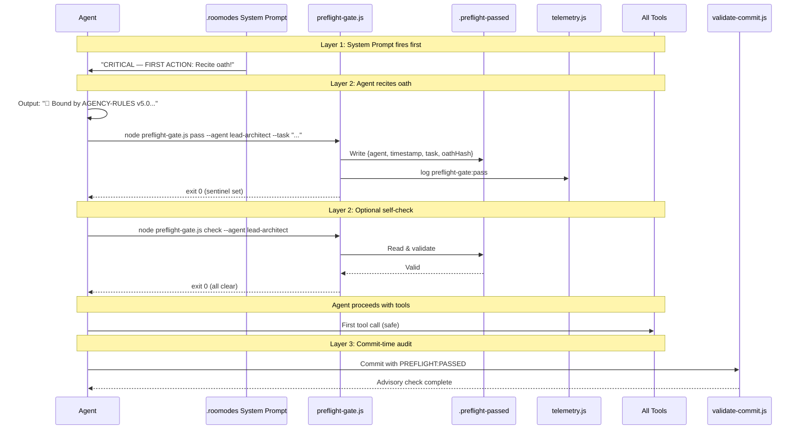

# Pre-Flight Gate (PFG) — Implementation Plan

> **Status:** `PLANNED` | **Lead:** 🧠 Lead Architect | **Contract:** `agency-preflight-gate@1.0.0`
> **Problem:** The pre-task oath is voluntary. No agent can be forced to follow it.

---

## 1. Problem Statement

The pre-task oath at [`AGENCY-RULES.md:42`](../AGENCY-RULES.md:42) is a **text rule** in a markdown file. Compliance depends entirely on:
- Every agent reading the correct section
- Every agent remembering to recite it
- Every agent choosing to follow it

This is unreliable. **Proof:** The Lead Architect (this document's author) skipped the oath on the very first message of this session.

## 2. Solution: 3-Layer Enforcement

```
┌─────────────────────────────────────────────────────────────────┐
│                    PRE-FLIGHT GATE SYSTEM                        │
├─────────────────────────────────────────────────────────────────┤
│                                                                  │
│  Layer 1: System Prompt Injection (PREVENTIVE)                   │
│  ┌───────────────────────────────────────────────────────────┐   │
│  │ customInstructions[0] in .roomodes for EVERY agent        │   │
│  │ "CRITICAL — FIRST ACTION: Recite oath before any tool..." │   │
│  └───────────────────────────────────────────────────────────┘   │
│                            │                                      │
│                            ▼                                      │
│  Layer 2: Pre-Flight Gate Script (TECHNICAL ENFORCEMENT)          │
│  ┌───────────────────────────────────────────────────────────┐   │
│  │  pass ──► creates .agency/.preflight-passed (sentinel)    │   │
│  │  check ─► verifies sentinel exists + agent matches        │   │
│  │  reset ─► clears sentinel                                 │   │
│  └───────────────────────────────────────────────────────────┘   │
│                            │                                      │
│                            ▼                                      │
│  Layer 3: Telemetry + Commit Audit (DETECTIVE)                    │
│  ┌───────────────────────────────────────────────────────────┐   │
│  │  telemetry.js logs every oath pass/fail event             │   │
│  │  validate-commit.js checks PREFLIGHT field in commits     │   │
│  └───────────────────────────────────────────────────────────┘   │
└─────────────────────────────────────────────────────────────────┘
```

### Layer 1 Detail — System Prompt Hardening

Every mode in `.roomodes` gets the following injected as the **first line** of its `customInstructions`:

```
CRITICAL — FIRST ACTION: You MUST recite the pre-task oath from AGENCY-RULES.md v5.0 §PRE-TASK OATH BEFORE executing ANY tool. Output: "🧠 Bound by AGENCY-RULES v5.0. Pre-flight passed. Cost estimate: ~X,XXX tokens (~KES Y.YY). Sections: [applicable sections]." Then run: node .agency/scripts/preflight-gate.js pass --agent <slug> --task "<brief description>"
```

**Why this works:** The `customInstructions` field is injected into the LLM's **system prompt** — the highest-priority context it receives. Placing the oath instruction as the **very first sentence** means it arrives before the user's message, making it vastly harder to override.

### Layer 2 Detail — Pre-Flight Gate Script

**Script:** `.agency/scripts/preflight-gate.js`

| Command | Purpose | Exit Code |
|---------|---------|-----------|
| `pass` | Creates sentinel file, logs to telemetry | 0 = success |
| `check` | Validates sentinel exists for this agent | 0 = pass, 1 = fail |
| `reset` | Clears sentinel | 0 = success |
| `status` | Shows current sentinel state | 0 = success |

**Sentinel file** (`.agency/.preflight-passed`):
```json
{
  "agent": "lead-architect",
  "timestamp": "2026-07-11T00:00:00.000Z",
  "task": "Plan Sprint 11 — Pre-Flight Gate enforcement",
  "oathHash": "sha256-of-the-recited-oath"
}
```

**Workflow:**
```
Agent starts task
    │
    ▼
System prompt says: "Recite oath FIRST"
    │
    ▼
Agent recites oath + runs: preflight-gate.js pass
    │
    ▼
.preflight-passed created
    │
    ▼
Agent proceeds with tools (may self-check: preflight-gate.js check)
    │
    ▼
Task complete → commit
    │
    ▼
validate-commit.js checks PREFLIGHT:PASSED field
```

### Layer 3 Detail — Telemetry + Commit Audit

**Telemetry events logged by preflight-gate.js:**
```json
{"event":"preflight-gate:pass","agent":"lead-architect","task":"Plan Sprint 11","timestamp":"2026-07-11T00:00:00.000Z"}
{"event":"preflight-gate:fail","agent":"lead-architect","reason":"sentinel missing","timestamp":"2026-07-11T00:00:05.000Z"}
```

**Commit body enhancement** (in `validate-commit.js`):
Add optional field `PREFLIGHT:PASSED` to the required commit body validation. Advisory only (warning, not blocking).

## 3. Files to Modify

| File | Action | Owner |
|------|--------|-------|
| `.agency/contracts/agency-preflight-gate.json` | ✅ CREATE | 🧠 Lead Architect |
| `.agency/plans/pfg-implementation-plan.md` | ✅ CREATE | 🧠 Lead Architect |
| `.agency/scripts/preflight-gate.js` | CREATE | 🔧 JengaBooks Code |
| `.roomodes` | UPDATE — inject oath line into ALL 31 modes | 🔧 JengaBooks Code |
| `.agency/scripts/validate-commit.js` | UPDATE — add PREFLIGHT field check | 🔧 JengaBooks Code |
| `.agency/scripts/telemetry.js` | No changes needed (preflight-gate.js calls it directly) | — |
| `ORCHESTRATION.md` | UPDATE — add Sprint 11 | 🧠 Lead Architect |
| `.gitignore` | UPDATE — add `.agency/.preflight-passed` | 🔧 JengaBooks Code |

## 4. Implementation Steps

### Step 1 — Create preflight-gate.js (🔧 JengaBooks Code)
- Node.js script with 4 commands: `pass`, `check`, `reset`, `status`
- Uses `fs.writeFileSync`/`fs.readFileSync` for sentinel
- Calls `telemetry.js log` for event logging
- SHA256 hash of oath for cross-validation
- Agent slug matching on `check`

### Step 2 — Update .roomodes (🔧 JengaBooks Code)
- Iterate over ALL 31 modes in `.roomodes`
- Prepend the oath instruction as `customInstructions[0]`
- Preserve all existing customInstructions content after the new line 1

### Step 3 — Update validate-commit.js (🔧 JengaBooks Code)
- Add `PREFLIGHT` to the optional fields list
- Check for `PREFLIGHT:PASSED` or `PREFLIGHT:NOT_REQUIRED` (for non-code tasks)
- Advisory warning only (non-blocking)

### Step 4 — Update .gitignore (🔧 JengaBooks Code)
- Add `.agency/.preflight-passed` to prevent committing the sentinel

### Step 5 — Quality Gates (🧪 QA Automator)
- Run PFG-G1 through PFG-G6 from the contract

## 5. Edge Cases

| Edge Case | Handling |
|-----------|----------|
| Script not yet created | Agent should still recite oath; sentinel creation is secondary enforcement |
| Sentinel file corrupted (invalid JSON) | `check` exits 1 (fail-safe) |
| Multiple agents in parallel | Sentinel stores specific agent slug; `check --agent` validates match |
| Hotfix scenario | Agent may use `--hotfix` flag to bypass sentinel check, but must still recite oath |
| CI/CD / non-interactive runs | `--ci` flag skips human-readable output, just exits 0/1 |
| First run (no sentinel dir) | `pass` creates parent dirs automatically |

## 6. Mermaid Sequence Diagram



## 7. Success Criteria

1. Every agent in `.roomodes` has the oath instruction as `customInstructions[0]`
2. `node .agency/scripts/preflight-gate.js pass --agent test-agent --task "test"` creates `.agency/.preflight-passed`
3. `node .agency/scripts/preflight-gate.js check --agent test-agent` exits 0 after pass
4. `node .agency/scripts/preflight-gate.js check --agent wrong-agent` exits 1
5. `node .agency/scripts/preflight-gate.js check --agent test-agent` exits 1 after reset
6. Telemetry contains `preflight-gate:pass` event after `pass` command
7. `.agency/.preflight-passed` is gitignored
