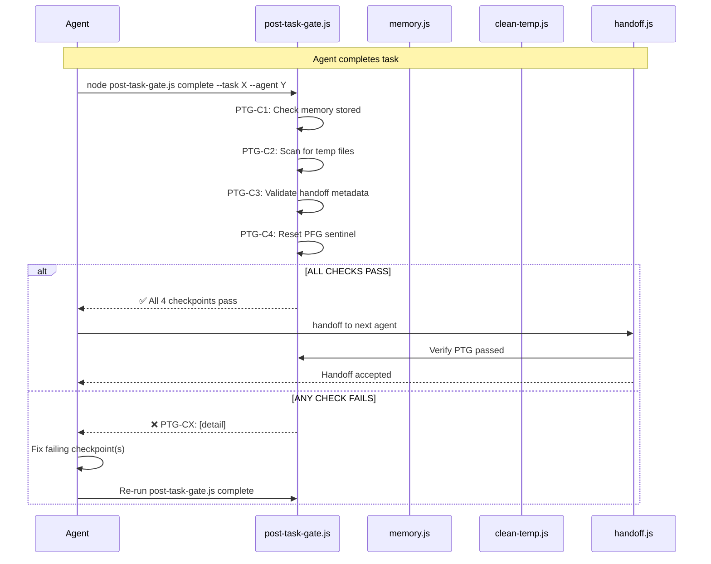

# Post-Task Gate (PTG) — Implementation Plan

> **Status:** `PLANNED` | **Lead:** 🧠 Lead Architect | **Contract:** `agency-post-task-gate@1.0.0`
> **Problem:** Pre-Flight Gate enforces task START but nothing enforces task END.

---

## 1. Problem

The Pre-Flight Gate (Sprint 11) ensures every agent recites the oath before starting work. But when the task is done, there's no gate preventing the agent from walking away without:
- Cleaning up temp files (§13 File Clutter Prevention)
- Storing key decisions to memory (§2 MEMORY field)
- Validating handoff metadata (§8 Git Handshake)
- Resetting the PFG sentinel for the next agent

**Proof:** Sprint 13 — JengaBooks Code agent violated all 4 post-task rules.

## 2. Solution: Post-Task Gate (PTG)

```
┌─────────────────────────────────────────────────────────────────┐
│                    POST-TASK GATE SYSTEM                         │
├─────────────────────────────────────────────────────────────────┤
│                                                                  │
│  Layer 1: Post-Task Gate Script (ENFORCED)                       │
│  ┌───────────────────────────────────────────────────────────┐   │
│  │  post-task-gate.js complete --task X --agent Y            │   │
│  │  ┌─────────────────────────────────────────────────────┐  │   │
│  │  │ PTG-C1: Memory stored?                              │  │   │
│  │  │ PTG-C2: Temp files cleaned?                         │  │   │
│  │  │ PTG-C3: Handoff metadata valid?                     │  │   │
│  │  │ PTG-C4: PFG sentinel reset?                         │  │   │
│  │  └─────────────────────────────────────────────────────┘  │   │
│  │  Output: ✅ PASS / ❌ FAIL (with details per checkpoint)   │   │
│  └───────────────────────────────────────────────────────────┘   │
│                            │                                      │
│                            ▼                                      │
│  Layer 2: handoff.js Integration (BLOCKING)                       │
│  ┌───────────────────────────────────────────────────────────┐   │
│  │  handoff.js calls post-task-gate.js check BEFORE proceed  │   │
│  │  If PTG fails → handoff BLOCKED, exit 1, log to telemetry │   │
│  └───────────────────────────────────────────────────────────┘   │
│                            │                                      │
│                            ▼                                      │
│  Layer 3: Telemetry + Commit Audit (DETECTIVE)                    │
│  ┌───────────────────────────────────────────────────────────┐   │
│  │  PTG events logged to telemetry                           │   │
│  │  PTG:PASSED field in handoff commit body                  │   │
│  └───────────────────────────────────────────────────────────┘   │
└─────────────────────────────────────────────────────────────────┘
```

## 3. Checkpoint Details

### PTG-C1: Memory Stored
- Checks if `memory.js store` was called for this task+agent
- Scans `store.json` for matching task ID and agent slug
- Fail message: `❌ Memory not stored. Run: node .agency/scripts/memory.js store --content "..." --tags "..." --task "<id>" --agent "<slug>"`

### PTG-C2: Temp Files Cleaned
- Scans root + e2e/ for temp artifacts: `temp-*`, `*.bak`, `debug-*`, `ROO-*`, `PLAN-*`, `$null`
- Fail message: `❌ Temp files found: [list]. Run: node .agency/scripts/clean-temp.js`

### PTG-C3: Handoff Metadata Valid
- Validates the commit message has all required fields
- Uses `validate-commit.js` logic internally or delegates to it
- Fail message: `❌ Missing fields: [list]. Add: HANDOFF, ARTIFACTS, CONTRACT, STATUS, MEMORY`

### PTG-C4: PFG Sentinel Reset
- Checks that `.agency/.preflight-passed` does NOT exist
- If exists, runs `preflight-gate.js reset` automatically
- Fail message: `❌ PFG sentinel still active. Auto-resetting...`

## 4. Files to Modify

| File | Action | Owner |
|------|--------|-------|
| `.agency/contracts/agency-post-task-gate.json` | ✅ CREATE | 🧠 Lead Architect |
| `.agency/plans/ptg-implementation-plan.md` | ✅ CREATE | 🧠 Lead Architect |
| `.agency/scripts/post-task-gate.js` | CREATE | 🔧 JengaBooks Code |
| `.agency/scripts/handoff.js` | UPDATE — integrate PTG check | 🔧 JengaBooks Code |
| `ORCHESTRATION.md` | UPDATE — add Sprint 14 | 🧠 Lead Architect |

## 5. Mermaid Sequence



## 6. Success Criteria

1. `node .agency/scripts/post-task-gate.js complete --task test --agent test` exits 0 if all 4 pass
2. Without memory stored → C1 fails
3. With temp files present → C2 fails
4. Without handoff metadata → C3 fails
5. With PFG sentinel active → C4 auto-resets + fails (advisory)
6. `handoff.js` blocks handoff if PTG not passed
7. Telemetry contains `post-task-gate:check` event
